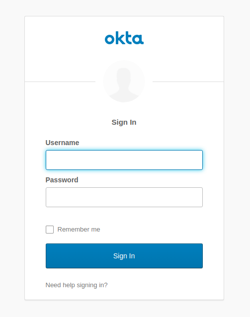

In 2013 Github released its search functionality, allowing to scan code in all public repositories, and a day after the release they had to partially shut it down. It was speculated that the feature allowed any user to search for all kinds of secrets stored in Github repositories. Even if that seems long ago, as explained by the study of NC State University, secrets leakage seems to remain pervasive and constant, and happens to all kinds of developers. Secrets leakage can lead to all kinds of cyber-attacks: data loss or corruption, sensitive data breaches and cryptojacking (cryptocurrency mining using victim's cloud computer power).
This year, 2020, an Amazon engineer leaked customer secrets through a public Github repository. Some of the uploaded documents contained access keys for cloud services. Although the data had been committed inadvertently, the leaked credentials were retrieved by a third party within the half hour.

Today, it is widely recommended to never store secret values in code. Therefore, the next sections will demonstrate the following alternatives:
- Using environment variables for Spring Boot secrets
- Secrets encryption and Cloud Config
- Secrets management and Vault
- Using Spring Cloud Config with Vault


## Using Environment Variables for Secrets

Spring Boot applications can bind properties from environment variables. Let's create the `vault-demo-app` with Spring Initializr, with web, okta and cloud-config-client dependencies, some of which will be required later in the tutorial:

```shell
curl https://start.spring.io/starter.zip \
-d dependencies=web,okta,cloud-config-client \
-d groupId=com.okta.developer \
-d artifactId=vault-demo-app  \
-d name="Spring Boot Application" \
-d description="Demo project of a Spring Boot application with Vault protected secrets" \
-d packageName=com.okta.developer.vault \
-o vault-demo-app.zip
```

Unzip the file and open the project. Modify the `Application` class to add the rest endpoint `/`:
```java
package com.okta.developer.vault;

import org.springframework.boot.SpringApplication;
import org.springframework.boot.autoconfigure.SpringBootApplication;
import org.springframework.security.core.annotation.AuthenticationPrincipal;
import org.springframework.security.oauth2.core.oidc.user.OidcUser;
import org.springframework.web.bind.annotation.GetMapping;
import org.springframework.web.bind.annotation.RestController;


@RestController
@SpringBootApplication
public class Application {

	public static void main(String[] args) {
		SpringApplication.run(Application.class, args);
	}

	@GetMapping("/")
	String hello(@AuthenticationPrincipal OidcUser user){
		return String.format("Welcome, %s", user.getFullName());
	}

}
```

For the Okta authentication setup, register for a [free developer account](https://developer.okta.com/signup/). After the login, go to the **Dashboard** section and copy your Org URL form the top right corner.
The go to **Applications** and create a new **Web** application.
Set the following configuration:

- Name: vault-demo-app
- Base URIs: http://localhost:8080/
- Login redirect URIs: http://localhost:8080/login/oauth2/code/oidc
- Logout redirect URIs: http://localhost:8080
- Grant type allowed: Authorization Code, Refresh Token

Copy the **Client ID** and **Client secret**.
Instead of storing Okta credentials in `application.properties`, with Spring Boot you can bind properties from environment variables. For a dev test, start the application with the maven command below:

```shell
SPRING_SECURITY_OAUTH2_CLIENT_PROVIDER_OIDC_ISSUER_URI={yourOrgUrl} \
SPRING_SECURITY_OAUTH2_CLIENT_REGISTRATION_OIDC_CLIENT_ID={youtClientId} \
SPRING_SECURITY_OAUTH2_CLIENT_REGISTRATION_OIDC_CLIENT_SECRET={yourClientSecret} \
./mvnw spring-boot:run
```


Go to http://localhost:8080, you should see th Okta login page:




In the application logs, you should see the security filter chain should initialize an OAuth2 authentication stack:
```
2020-04-07 00:19:45.952  INFO 12058 --- [           main] o.s.s.web.DefaultSecurityFilterChain     : Creating filter chain: any request, [org.springframework.security.web.context.request.async.WebAsyncManagerIntegrationFilter@5c080ef3, org.springframework.security.web.context.SecurityContextPersistenceFilter@6ecdbab8, org.springframework.security.web.header.HeaderWriterFilter@5a2fa51f, org.springframework.security.web.csrf.CsrfFilter@2016f509, org.springframework.security.web.authentication.logout.LogoutFilter@23a5818e, org.springframework.security.oauth2.client.web.OAuth2AuthorizationRequestRedirectFilter@14823f76, org.springframework.security.oauth2.client.web.OAuth2AuthorizationRequestRedirectFilter@7b6e5c12, org.springframework.security.oauth2.client.web.OAuth2LoginAuthenticationFilter@7979b8b7, org.springframework.security.web.authentication.ui.DefaultLoginPageGeneratingFilter@17d32e9b, org.springframework.security.web.authentication.ui.DefaultLogoutPageGeneratingFilter@188cbcde, org.springframework.security.web.savedrequest.RequestCacheAwareFilter@19f7222e, org.springframework.security.web.servletapi.SecurityContextHolderAwareRequestFilter@5ba26eb0, org.springframework.security.web.authentication.AnonymousAuthenticationFilter@4ee6291f, org.springframework.security.oauth2.client.web.OAuth2AuthorizationCodeGrantFilter@2def7a7a, org.springframework.security.web.session.SessionManagementFilter@22a0d4ea, org.springframework.security.web.access.ExceptionTranslationFilter@73d4066e, org.springframework.security.web.access.intercept.FilterSecurityInterceptor@7342e05d]

```

Using environment variables for passing secrets to containerized applications seems to be now considered a bad practice, because the environment can be inspected or logged in a number of cases. So let's move on to using Spring Cloud Config server for secrets storage.

## Spring Cloud Config with Secrets Encryption

In microservice architectures, managing configuration with a centralized config server is essential. Secret encryption is desirable at rest and when in transit. Spring Cloud Config Server is a popular implementation, let's configure the server to store encrypted secrets.

**IMPORTANT:** To use encryption and decryption features you must install the Java Cryptography Extension (JCE) in yout JVM, whis is not included by default.


Using Spring Initializr API, create the vault-config-server application:

```shell
curl https://start.spring.io/starter.zip \
-d dependencies=cloud-config-server \
-d groupId=com.okta.developer \
-d artifactId=vault-config-server  \
-d name="Spring Boot Configuration Server" \
-d description="Demo project of a Spring Boot application with Vault protected secrets" \
-d packageName=com.okta.developer.vault \
-o vault-config-server.zip
```

Unzip the downloaded file. Rename `src/main/resource/application.properties` to `src/main/resource/application.yml`, end edit to add the native profile :

```yml
server:
  port: 8888

spring:
  profiles:
    active: native
  cloud:
    config:
      server:
        native:
          serachLocations: classpath://config
```


Start the server, as we are going to encrypt the Okta secrets using the `/encrypt` endpoint. For this example we are using a symmetric (shared) encryption key, passed through the environment variable ENCRYPT_KEY.

```shell
ENCRYPT_KEY={encryptKey} ./mvnw spring-boot:run
```
```shell
curl localhost:8888/encrypt -d {yourOktaClientId}
curl localhost:8888/encrypt -d {yourOktaClientSecret}
```

In the server project folder, create the file `src/main/resources/config/vault-demo-app-dev.yml` to store the secrets for `vault-demo-app`, for the profile `dev`, with the following contents:

```yml
spring:
  security:
    oauth2:
      client:
        provider:
          oidc:
            issuer-uri: https://dev-753567.okta.com/oauth2/default
        registration:
          oidc:
            client-id: '{cipher}encrypted-client-id'
            client-secret: '{cipher}ecrypted-client-secret'
```

The `client-id` and `client-secret` encrypted values must be prefixed with `{cipher}`.

To consume the config server properties, the client application must set the server address in the bootstrap properties. In the `vault-demo-app` project folder, create the file `src/main/resources/bootstrap.yml` with the following content:

```yml
spring:
  application:
    name: vault-demo-app
  cloud:
    config:
      uri: http://localhost:8888
  profiles:
    active: dev
```

Start `vault-demo-app` as before, and when requesting http://localhost:8080 it should again redirect to the Okta login.

In a real environment, the config server will be secured. Spring Cloud Config Server supports asymmetric key encryption as well, with the server encrypting with the public key, and the clients decrypting with the private key. However, the documentation warns about spreading the key management process around clients.

## Vault as a Cloud Configuration Backend


With the cloud, secrets management became much more difficult.
Vault is a secrets management and data protection tool from Hashicorp, that provides secure storage, dynamic secret generation, data encryption and secret revocation. Secrets operations can be audited by enabling audit devices, which will send audit logs to a file, syslog or socket.
As Spring Cloud Configuration Server supports Vault as a configuration backend, the next step is to better protect the application secrets by storing them in Vault.
Pull the Vault docker image and start a container:

```shell
docker pull vault
docker run --cap-add=IPC_LOCK -e 'VAULT_DEV_ROOT_TOKEN_ID=00000000-0000-0000-0000-000000000000' -p 8200:8200 --name my-vault vault
```

IPC_LOCK capability is required for Vault to be able lock memory and not be swapped to disk, as this behavior is enabled by default.
As the instance is run for development, the id of the initial generated root token is set to the given value.


2. Unseal token
3. UI
4. Create token


In the `vault-config-server`, edit `src/main/resource/application.yml` to add Vault as the config backend:

```yml
server:
  port: 8888

spring:
  profiles:
    active: vault
  cloud:
    config:
      server:
        vault:
          host: 127.0.0.1
          port: 8200
          kvVersion: 2
logging:
  level:
    root: TRACE          
```

We also set the logging level to TRACE, to see the interaction between the server and Vault.
Start the `vault-config-server`:

```shell
cd vault-config-server
./mvnw spring-boot:run
```
You should see the logs below if the server was configured correctly:
```
2020-04-07 01:19:10.105  INFO 14072 --- [           main] SpringBootConfigurationServerApplication : Started SpringBootConfigurationServerApplication in 4.525 seconds (JVM running for 4.859)
```

In the `vault-demo-app` project folder, modify the file `src/main/resources/bootstrap.yml` to add the token required for requesting secrets to Vault. Set the value created during the Vault intro.

```yml
spring:
  application:
    name: vault-demo-app
  cloud:
    config:
      token: {vaultToken}
      uri: http://localhost:8888
  profiles:
    active: dev
```

In a terminal, connect to the vault instance and add the key-values for the `vault-demo-app` dev profile.

```shell
docker exec -it my-vault /bin/sh
export VAULT_TOKEN="00000000-0000-0000-0000-000000000000"
export VAULT_ADDR="http://127.0.0.1:8200"
vault kv put secret/vault-demo-app,dev spring.security.oauth2.client.registration.oidc.client-id="{yourClientID}" spring.security.oauth2.client.registration.oidc.client-secret="{yourClientSecret}" spring.security.oauth2.client.provider.oidc.issuer-uri="{yourOrgUrl}"
```
You can check the values inserted with the **get** vault command:

```shell
vault kv get secret/vault-demo-app,dev
```

Start the application and go to http://localhost:8080, you should see the Okta login page again.


## Learn More

I hope you could see the benefits of using a secrets management tool like Vault as a configuration backend, as opposed to storing secrets in a file, in a file system or in a code repository. To learn more about Okta, Vault and Spring Cloud check out the following links:

* [How Bad Can It Git?](https://www.ndss-symposium.org/wp-content/uploads/2019/02/ndss2019_04B-3_Meli_paper.pdf)
* [Spring Cloud Config - Vault Backend](https://cloud.spring.io/spring-cloud-config/reference/html/#vault-backend)
* [Container Secrets with Vault](https://www.hashicorp.com/resources/securing-container-secrets-vault)
* [Amazon Engineer Leaked Private Encryption Keys](https://gizmodo.com/amazon-engineer-leaked-private-encryption-keys-outside-1841160934)
